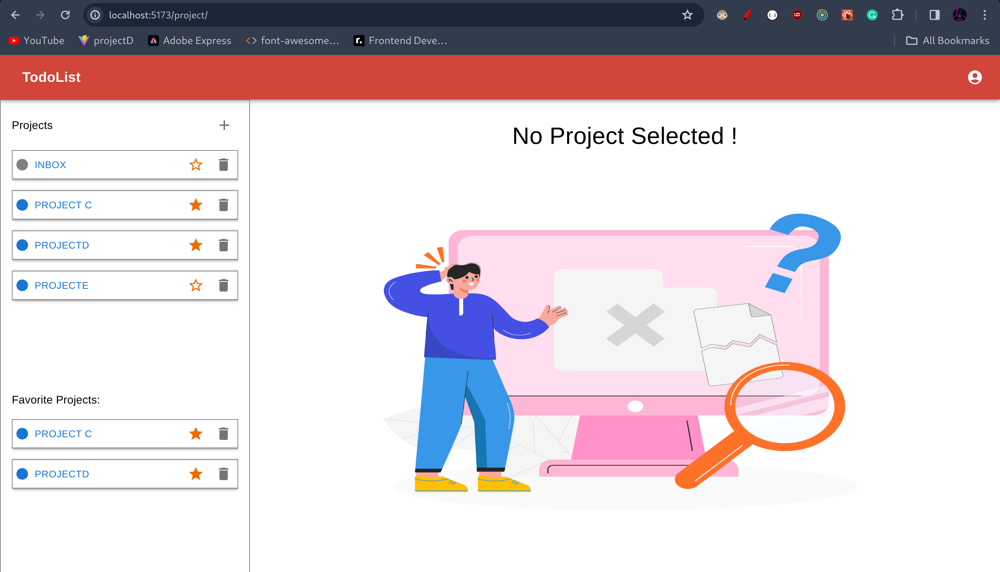
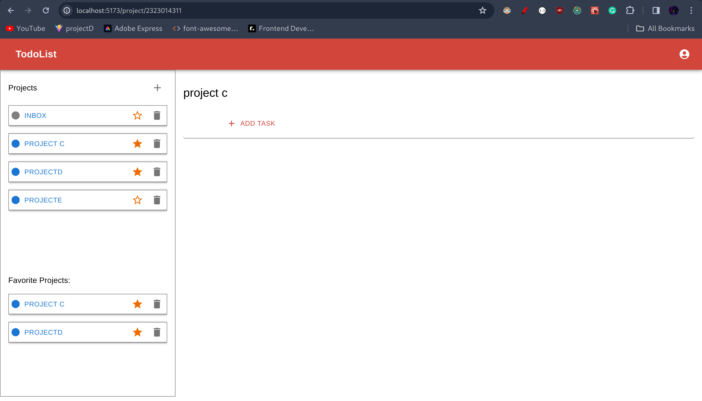
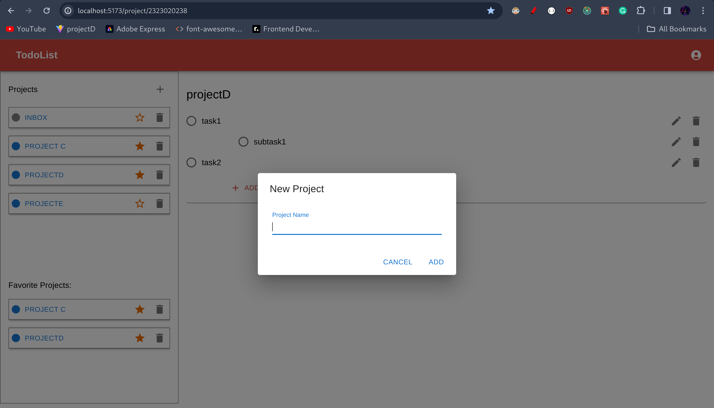
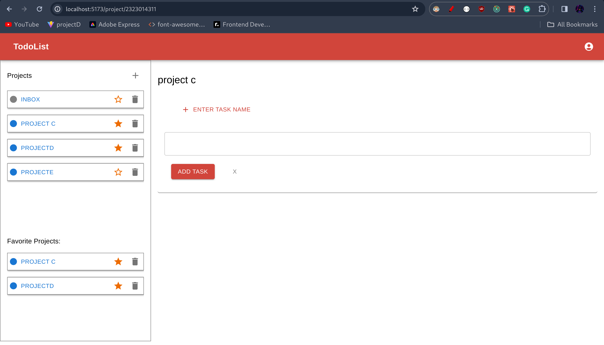
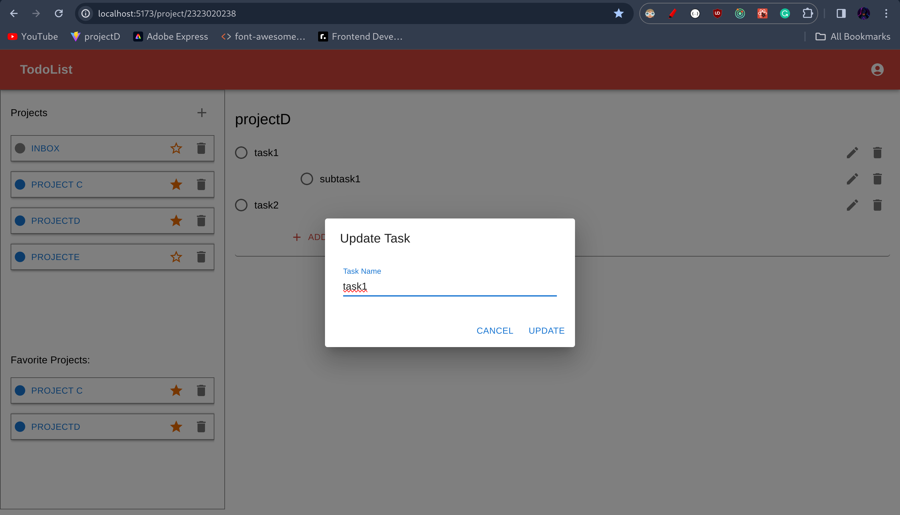
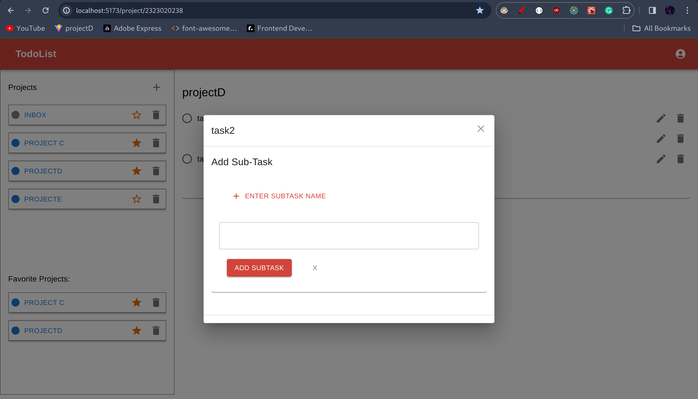
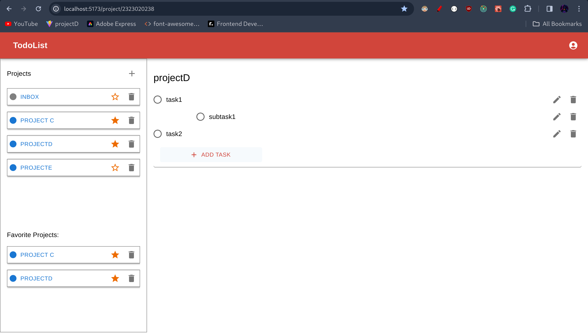

# TodoList 

### Built with

- React 
- Redux 
- Material UI

##  Screenshot : 

### No proejct Selected : -

### Project Selected : - 

### Create Project : -

### Add Task : -

### Update Task : -

### Add SubTask : -

### Project With Tasks & SubTasks:- 

